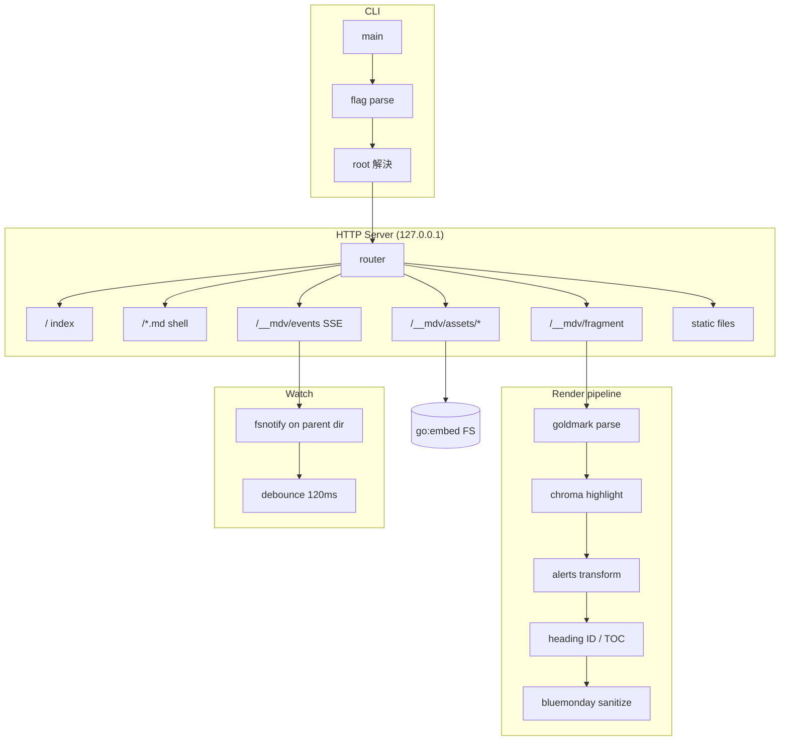

# mdv — Go 実装仕様書

`mdv` は、CLI から Markdown ファイルを指定するとブラウザで整形表示するローカルツールである。

- **Version**: 1.0 (draft)
- **Status**: 実装前
- **Basis**: Node.js リファレンス実装（`mdv.js`, SHA-256 `91ad4d33…e01e545`）で検証済みの設計を Go に移植する

> [!NOTE]
> 本仕様は上記 Node 実装の実測結果を根拠としている。「検証済み」と記した項目は実際にテストを通した挙動であり、「要検証」と記した項目は Go 移行にあたって実装時に確認すべき未確定事項である。

---

## 1. 目的と背景

### 1.1 解決する課題

Markdown を読む手段が、いずれも要件を満たさない。

| 手段 | 問題 |
|---|---|
| `cat` / `bat` | 図表・リンク・入れ子が読みにくい |
| Neovim プラグイン | エディタを開く必要がある。エディタを閉じるとプレビューも閉じる |
| `grip` / `gh markdown-preview` | レンダリングを GitHub API に投げるため、本文が外部送信される |
| `mdopen` | ローカル完結だが Mermaid 未対応・TOC なし |

### 1.2 目標

1. CLI 一発でブラウザに整形表示する（`mdv README.md`）
2. エディタから独立したプロセスとして常駐する
3. **Markdown 本文を外部に一切送信しない**
4. Mermaid 図・GitHub Alerts・TOC を含めて「わかりやすく」描画する
5. 単一バイナリで配布し、ランタイム依存を持たない

### 1.3 非目標 (Non-goals)

- Markdown の**編集**機能（閲覧専用。編集はエディタの仕事）
- WYSIWYG / スプリットビュー
- リモートホスティング・複数ユーザー対応
- PDF エクスポート（v1 では対象外。将来拡張とする）
- Markdown 以外のドキュメント形式

---

## 2. Node 版からの設計変更

Go に移すことで改善できる点があるため、単純移植ではなく以下を変更する。

| 項目 | Node 版 | Go 版 | 理由 |
|---|---|---|---|
| Markdown → HTML | クライアント側（marked.js） | **サーバ側（goldmark）** | 描画結果が決定的になる。ブラウザ差異が消える |
| シンタックスハイライト | highlight.js（HCL 文法を自前登録） | **chroma（サーバ側）** | chroma は HCL/Terraform lexer を標準搭載。自前文法が不要になる |
| サニタイズ | DOMPurify（クライアント） | **bluemonday（サーバ）** | 信頼できない HTML をブラウザに渡す前に落とせる |
| アセット配布 | 初回に CDN 取得 → `~/.cache` | **`go:embed` で埋め込み** | 完全オフライン。初回起動もネットワーク不要 |
| ファイル監視 | `fs.watchFile`（stat ポーリング） | **fsnotify（親ディレクトリ監視）+ ポーリングfallback** | 後述 §7.2 |
| 配布形態 | Node 18+ 必須 | 単一バイナリ | インストールが `cp` だけで済む |

Mermaid だけはブラウザで SVG を生成するため、クライアント側に残る。

---

## 3. CLI 仕様

### 3.1 起動形式

```
mdv [OPTIONS] [PATH]
```

### 3.2 引数

| 引数 | 必須 | 既定値 | 説明 |
|---|---|---|---|
| `PATH` | 任意 | `.` | `.md` ファイル、またはディレクトリ |

- `PATH` がファイル → そのファイルを開く。**サーブ対象のルートは親ディレクトリ**
- `PATH` がディレクトリ → そのディレクトリをルートとし、`.md` 一覧ページを開く
- `PATH` が存在しない → エラー終了（exit 1）

### 3.3 フラグ

| 短 | 長 | 型 | 既定値 | 説明 |
|---|---|---|---|---|
| `-p` | `--port` | int | `4649` | 待ち受けポート。使用中なら +1 して最大 20 回まで繰り上げ |
| | `--host` | string | `127.0.0.1` | バインドアドレス |
| `-n` | `--no-open` | bool | `false` | ブラウザを自動で開かない |
| `-q` | `--quiet` | bool | `false` | アクセスログを抑制 |
| `-h` | `--help` | bool | | ヘルプを表示して exit 0 |
| `-V` | `--version` | bool | | バージョンを表示して exit 0 |

標準ライブラリの `flag` パッケージは `-port` と `--port` の両方を受理するため、外部の CLI ライブラリは導入しない。

### 3.4 終了コード

| コード | 条件 |
|---|---|
| 0 | 正常終了（`--help` / `--version` / SIGINT・SIGTERM 受信） |
| 1 | 引数エラー、パス不存在、ポート確保失敗、その他の起動時エラー |

### 3.5 標準出力・標準エラー

- 起動メッセージ・アクセスログは **stderr** に出す
- `--help` / `--version` の出力は **stdout**（パイプで扱えるように）

```
mdv: serving /Users/gr1m0h/work/docs
mdv: http://127.0.0.1:4649/README.md  (Ctrl-C to stop)
  GET /README.md
  GET /__mdv/fragment?path=README.md
```

### 3.6 シグナル

`SIGINT` / `SIGTERM` を受けたら HTTP サーバを graceful shutdown（タイムアウト 3 秒）し、exit 0。

---

## 4. アーキテクチャ



### 4.1 レンダリングの責務分割

サーバ側で完結させ、ブラウザ側は「差し替え」と「Mermaid 描画」だけを担う。

- **サーバ**: Markdown パース、ハイライト、Alerts 変換、見出し ID 付与、TOC 生成、サニタイズ
- **ブラウザ**: SSE 受信 → fragment 取得 → DOM 差し替え → Mermaid 実行 → スクロール位置復元

この分割により、ブラウザ側の JS は 150 行程度に収まり、Mermaid 以外の外部 JS が不要になる。

---

## 5. HTTP API 仕様

すべて `GET` のみ。`POST` 等は 405 を返す。

| パス | レスポンス | 説明 |
|---|---|---|
| `/` | `text/html` | ルート配下の `.md` 一覧ページ |
| `/{path}.md` | `text/html` | 表示用シェル HTML（本文は空。JS が fragment を取得） |
| `/__mdv/fragment?path=` | `application/json` | レンダリング済み HTML + TOC + タイトル |
| `/__mdv/events?path=` | `text/event-stream` | ファイル変更通知（SSE） |
| `/__mdv/assets/{name}` | 各種 | 埋め込みアセット（CSS / mermaid.js / favicon） |
| `/{path}` （その他） | 各種 | 画像等の静的ファイル |

### 5.1 `/__mdv/fragment`

```json
{
  "html": "<h1 id=\"...\">...</h1>...",
  "title": "mdv 動作確認",
  "toc": [
    { "level": 1, "id": "mdv-動作確認", "text": "mdv 動作確認" },
    { "level": 2, "id": "mermaid",      "text": "Mermaid" }
  ],
  "hasMermaid": true
}
```

- `hasMermaid` が `false` のときブラウザは mermaid.js をロードしない（初期表示を軽くする）
- `Cache-Control: no-store`

### 5.2 `/__mdv/events`

SSE。イベント名は既定（`message`）、データは `reload` 固定。

```
: connected

data: reload

: ping
```

- 25 秒ごとにコメント行（`: ping`）でキープアライブ
- クライアント切断時（`Request.Context().Done()`）に watcher を解放すること

### 5.3 ステータスコード

| コード | 条件 |
|---|---|
| 200 | 正常 |
| 302 | ディレクトリへのアクセス → `/` にリダイレクト |
| 400 | URL / クエリのデコード失敗 |
| 403 | ルート外へのアクセス（シンボリックリンク経由を含む） |
| 404 | ルート内だが存在しないパス、未知のアセット名 |
| 405 | `GET` 以外のメソッド |
| 415 | 許可していない拡張子の静的ファイル |

> [!IMPORTANT]
> **403 と 404 の使い分けを守ること。** ルート外へのアクセスは 403、ルート内の不存在は 404 とする。Node 版の初期実装では `realpath` を存在しないパスに対して呼んでいたため、正常な typo まで 403 になっていた。実在する最も深い祖先に対して `filepath.EvalSymlinks` を呼ぶ形に修正して解決した（§8.1）。

---

## 6. レンダリングパイプライン

### 6.1 goldmark 設定

```
extension.GFM              // table, strikethrough, linkify, tasklist
extension.Footnote
extension.DefinitionList   // 任意
parser.WithAutoHeadingID   // ただし §6.4 のカスタム生成器で置き換える
html.WithUnsafe()          // 生 HTML を通す。安全性は bluemonday で担保する
```

### 6.2 シンタックスハイライト

`goldmark-highlighting/v2`（chroma バックエンド）を使う。

- スタイル: light = `github`, dark = `github-dark`
- 出力形式: **クラス方式**（`WithClasses(true)`）。インライン style ではなく CSS クラスを吐かせ、light/dark を CSS 側で切り替える
- chroma が認識できない言語指定はフォールバックしてプレーン表示にする（エラーにしない）

> [!TIP]
> chroma には HCL / Terraform の lexer が同梱されている。Node 版では highlight.js に HCL がなく、`highlightjs-terraform` も npm に存在しなかったため簡易文法を自作する必要があったが、Go 版ではこれが不要になる。**実装時に `chroma/lexers` で `hcl` と `terraform` が引けることを確認すること（要検証）。**

サポート必須の言語（SRE 業務での使用頻度による）:
`go`, `hcl` / `terraform`, `yaml`, `json`, `bash` / `shell`, `dockerfile`, `sql`, `typescript`, `ruby`, `python`, `diff`, `ini` / `toml`, `nginx`, `protobuf`

### 6.3 GitHub Alerts

goldmark は `> [!NOTE]` 記法を標準サポートしないため、**AST トランスフォーマとして自前実装**する。

対象: `NOTE` / `TIP` / `IMPORTANT` / `WARNING` / `CAUTION`

変換規則:

1. `Blockquote` ノードの最初の `Paragraph` の先頭テキストが `[!KIND]` にマッチするか判定
2. マッチしたら、そのマーカー部分を段落から除去
3. `Blockquote` に `alert alert-{kind}` クラスを付与
4. 先頭に `<div class="alert-title">` を挿入（アイコン + ラベル）
5. マーカー除去後に段落が空になり、かつ画像・インラインコードを含まないなら段落ごと削除

| kind | クラス | ボーダー色 | アイコン |
|---|---|---|---|
| note | `alert-note` | `#0969da` | ℹ️ |
| tip | `alert-tip` | `#1a7f37` | 💡 |
| important | `alert-important` | `#8250df` | ❗ |
| warning | `alert-warning` | `#9a6700` | ⚠️ |
| caution | `alert-caution` | `#cf222e` | 🛑 |

### 6.4 見出し ID と TOC

goldmark の `WithAutoHeadingID` は GitHub と異なる ID を生成するため、GitHub 互換の生成器を `parser.WithIDs()` で差し替える。

アルゴリズム:

1. 見出しのプレーンテキストを取得
2. 小文字化、前後の空白を除去
3. 連続する空白を `-` に置換
4. **Unicode の Letter / Number / `-` / `_` 以外を除去**（日本語見出しを保持するため）
5. 空文字になったら `section` を使う
6. 同一 ID が既出なら `-1`, `-2` … を付す

> [!NOTE]
> Node 版で `mdv 動作確認` → `mdv-動作確認`、`深い見出し` → `深い見出し` となることを実測で確認している（検証済み）。ASCII のみに落とす実装にすると日本語見出しの ID がすべて `section-N` に潰れるため、Unicode プロパティによる判定を必須とする。

TOC は `h1`〜`h4` を対象とし、AST を走査して `[]TOCEntry` を組み立てる。見出しが 2 個未満のときサイドバーを非表示にする。

### 6.5 Mermaid

goldmark の出力段階で、言語指定が `mermaid` のフェンスドコードブロックを次の形に置換する。

```html
<div class="mermaid">flowchart LR ...</div>
```

- コード本文は**必ずテキストとしてエスケープ**して埋め込む
- ブラウザ側で `mermaid.initialize({ startOnLoad: false, securityLevel: "strict" })` の後 `mermaid.run()` を呼ぶ
- `securityLevel: "strict"` を必須とする（Mermaid 経由の HTML 注入を防ぐ）
- Mermaid のテーマは配色モードに追従（light → `default`, dark → `dark`）

### 6.6 サニタイズ

bluemonday の `UGCPolicy` をベースに、以下を追加許可する。

| 許可対象 | 理由 |
|---|---|
| `class` 属性（`code`, `pre`, `span`, `div`, `blockquote`, `h1`-`h6`） | chroma・Mermaid・Alerts がクラスに依存する |
| `id` 属性（`h1`-`h6`） | TOC アンカー |
| `<table>` 系タグ | GFM テーブル |
| `<input type=checkbox disabled>` | タスクリスト |

`<script>` は一切許可しない。サニタイズは **Mermaid の `div` 生成より後、ブラウザに返す直前**に実行する。

---

## 7. ファイル監視とライブリロード

### 7.1 要件

- ファイル保存後 **500ms 以内**にブラウザの表示が更新される
- 更新後もスクロール位置が保持される
- サーバ再起動時、ブラウザは自動で再接続する

### 7.2 監視方式

> [!WARNING]
> **ファイル自体ではなく、親ディレクトリを監視すること。**
> Vim / Neovim は「一時ファイルに書き込んで `rename` で置き換える」方式を取るため、保存のたびに inode が変わる。ファイルパスを直接 `fsnotify.Add()` した場合、初回保存以降は監視が外れて通知が来なくなる。Node 版ではこの問題を回避するため、inotify ベースの `fs.watch` を捨てて stat ポーリングの `fs.watchFile` を採用した（検証済み）。
>
> Go では親ディレクトリを監視し、イベントのファイル名でフィルタすることで、inotify の性能を保ったまま rename を捕捉できる。

実装方針:

1. `watcher.Add(filepath.Dir(target))`
2. `Write` / `Create` / `Rename` イベントを受信し、`filepath.Clean(event.Name) == target` のものだけ通す
3. **120ms のデバウンス**を挟む（エディタが複数回書き込むため）
4. **フォールバック**: fsnotify の初期化に失敗した場合、または `MDV_WATCH=poll` が指定された場合は 300ms 間隔の `os.Stat` ポーリングに切り替える（ネットワークファイルシステム対策）

### 7.3 ブラウザ側の挙動

```
SSE 受信
  → window.scrollY を退避
  → /__mdv/fragment を fetch
  → #doc.innerHTML を差し替え
  → TOC を再構築
  → hasMermaid なら mermaid.run()
  → スクロール位置を復元
  → ステータスバーに "reloaded" を 1.2 秒表示
```

`EventSource.onerror` で 1.5 秒後に再接続する。

---

## 8. セキュリティ要件

このツールはクライアント業務の資料をプレビューする用途を想定するため、以下は**必須要件**とする。

### 8.1 パストラバーサル防止（二段構え）

```go
func (s *Server) safeResolve(rel string) (string, bool) {
    // 1) 正規化してルート起点で結合する。"../" はルートにクランプされる
    clean := filepath.Clean("/" + filepath.ToSlash(rel))
    abs := filepath.Join(s.root, clean)

    // 2) 文字列プレフィックス検査
    if abs != s.root && !strings.HasPrefix(abs, s.root+string(filepath.Separator)) {
        return "", false
    }

    // 3) 実在する最も深い祖先を EvalSymlinks し、リンク経由の脱出を検査する
    probe := abs
    for len(probe) > len(s.root) {
        if _, err := os.Lstat(probe); err == nil {
            break
        }
        probe = filepath.Dir(probe)
    }
    real, err := filepath.EvalSymlinks(probe)
    if err != nil {
        return "", false
    }
    if real != s.root && !strings.HasPrefix(real, s.root+string(filepath.Separator)) {
        return "", false
    }
    return abs, true
}
```

段 3 を「実在する祖先」に対して行うのが要点である。`abs` そのものに対して呼ぶと、ルート内の不存在パスまで弾いてしまう（§5.3 の注記）。

### 8.2 バインドアドレス

- 既定は `127.0.0.1` のみ
- `--host 0.0.0.0` を指定した場合、**stderr に警告を出す**

```
mdv: WARNING: listening on 0.0.0.0 — このマシンのネットワーク上の全員が
mdv: WARNING: /Users/gr1m0h/work/docs 以下を閲覧できます
```

### 8.3 外部通信の禁止

- 実行時にネットワークへ出る処理を**一切持たない**
- すべての CSS / JS を `go:embed` で埋め込む
- Markdown 中の `` はブラウザが取得するが、これはユーザーの文書に由来するものであり、ツールが本文を送信するわけではない

CI で「バイナリが外向き通信を行わないこと」を確認するテストを置くことが望ましい。

### 8.4 Content-Security-Policy

シェル HTML に以下を付与する。

```
default-src 'none';
script-src 'self';
style-src 'self' 'unsafe-inline';
img-src 'self' data: https:;
font-src 'self' data:;
connect-src 'self';
```

> [!CAUTION]
> Mermaid は一部の図種で `new Function` を使う実装があり、`script-src 'self'` のみでは動かない可能性がある。**実装時に全図種で検証し、必要なら `'unsafe-eval'` を追加するか、Mermaid のバージョンを固定すること（要検証）。** 安易に `'unsafe-inline'` を `script-src` に加えてはならない。

### 8.5 配信対象の制限

静的ファイルは許可リスト方式で拡張子を制限する。リストにない拡張子は 415 を返す。

許可: `.png .jpg .jpeg .gif .svg .webp .avif .ico .json .txt .pdf .css`

### 8.6 SVG の扱い

`.svg` を直接配信する場合、SVG 内のスクリプトが同一オリジンで実行されうる。`Content-Security-Policy: sandbox` ヘッダを付けるか、`Content-Disposition: attachment` とするか、いずれかを選ぶ（要検証）。

---

## 9. 依存ライブラリ

| モジュール | 用途 | 備考 |
|---|---|---|
| `github.com/yuin/goldmark` | Markdown パーサ | CommonMark 準拠 + GFM 拡張 |
| `github.com/yuin/goldmark-highlighting/v2` | chroma 連携 | |
| `github.com/alecthomas/chroma/v2` | シンタックスハイライト | HCL/Terraform 同梱 |
| `github.com/microcosm-cc/bluemonday` | HTML サニタイズ | |
| `github.com/fsnotify/fsnotify` | ファイル監視 | |

直接依存は 5 つ。CLI パース・HTTP・SSE・埋め込みはすべて標準ライブラリで賄う。

**埋め込みアセット**（`internal/assets/`）:

| ファイル | 出所 | 概算サイズ |
|---|---|---|
| `mermaid.min.js` | mermaid@11 | 3.5 MB |
| `github-markdown-light.css` | github-markdown-css@5 | 22 KB |
| `github-markdown-dark.css` | github-markdown-css@5 | 22 KB |
| `chroma-light.css` | chroma 生成 | 数 KB |
| `chroma-dark.css` | chroma 生成 | 数 KB |
| `mdv.css` | 自作（レイアウト・TOC・Alerts） | 数 KB |
| `mdv.js` | 自作（SSE・差し替え・テーマ） | 数 KB |

バイナリサイズは 10〜15 MB 程度になる。Mermaid が支配的なので、`-tags nomermaid` で除外できるビルドタグを用意してもよい。

各アセットのライセンス表記を `THIRD_PARTY_LICENSES` に含めること（mermaid: MIT, github-markdown-css: MIT, chroma: MIT）。

---

## 10. ディレクトリ構成

```
mdv/
├── main.go                     # フラグパース、root 解決、起動
├── go.mod
├── go.sum
├── internal/
│   ├── server/
│   │   ├── server.go           # ルータ、ハンドラ
│   │   ├── safepath.go         # safeResolve
│   │   ├── sse.go              # SSE ハンドラ
│   │   ├── index.go            # .md 一覧
│   │   └── server_test.go
│   ├── render/
│   │   ├── render.go           # goldmark パイプライン
│   │   ├── alerts.go           # GitHub Alerts 拡張
│   │   ├── headings.go         # ID 生成 + TOC
│   │   ├── mermaid.go          # mermaid フェンス変換
│   │   ├── sanitize.go         # bluemonday ポリシー
│   │   └── render_test.go
│   ├── watch/
│   │   ├── watch.go            # fsnotify + デバウンス
│   │   ├── poll.go             # ポーリング fallback
│   │   └── watch_test.go
│   ├── assets/
│   │   ├── assets.go           # go:embed
│   │   └── static/…
│   └── browser/
│       └── open.go             # darwin/linux/windows のブラウザ起動
├── testdata/
│   └── sample.md
└── README.md
```

---

## 11. 設定（環境変数）

| 変数 | 既定値 | 説明 |
|---|---|---|
| `MDV_PORT` | `4649` | `--port` の既定値を上書き |
| `MDV_HOST` | `127.0.0.1` | `--host` の既定値を上書き |
| `MDV_BROWSER` | （OS 既定） | 起動するブラウザのコマンド |
| `MDV_WATCH` | `fsnotify` | `poll` を指定するとポーリング監視に切り替え |
| `MDV_THEME` | `auto` | `auto` / `light` / `dark` の初期値 |
| `NO_COLOR` | | 設定時 stderr のカラー出力を抑制 |

優先順位: **フラグ > 環境変数 > 既定値**

---

## 12. ブラウザ起動

| OS | コマンド |
|---|---|
| darwin | `open <url>` |
| windows | `cmd /c start "" <url>` |
| その他 | `xdg-open <url>` |

`MDV_BROWSER` が設定されていればそれを優先する。起動に失敗しても**エラーにせず処理を続行する**（URL は既に stderr に出力済みのため、手動で開けばよい）。

---

## 13. 受け入れ基準

Node 版で実際に通したテストを移植する。すべて自動テストとして実装すること。

### 13.1 レンダリング

| # | 検証項目 | 期待結果 |
|---|---|---|
| R-1 | 見出し h1〜h4 の描画 | すべて `id` 属性を持つ |
| R-2 | 日本語見出しの ID | `mdv 動作確認` → `mdv-動作確認` |
| R-3 | 重複見出しの ID | 2 個目以降に `-1`, `-2` が付く |
| R-4 | GFM テーブル | `<table>` として描画される |
| R-5 | `mermaid` フェンス | `<div class="mermaid">` に変換され、`language-mermaid` が残らない |
| R-6 | `[!WARNING]` | `.alert-warning` が付き、本文から `[!WARNING]` が消える |
| R-7 | `[!TIP]` | `.alert-tip` が付き、タイトル行が挿入される |
| R-8 | Go コードブロック | chroma のトークンクラスが付与される |
| R-9 | HCL コードブロック | 同上（プレーン表示に落ちないこと） |
| R-10 | Dockerfile コードブロック | 同上 |
| R-11 | 未知の言語指定 | エラーにならずプレーン表示になる |
| R-12 | `<script>` を含む Markdown | サニタイズで除去される |
| R-13 | TOC | h1〜h4 のエントリが生成され、各リンクが実在する ID を指す |
| R-14 | ドキュメントタイトル | 最初の h1 から生成される |

### 13.2 HTTP

| # | リクエスト | 期待コード |
|---|---|---|
| H-1 | `GET /` | 200 |
| H-2 | `GET /README.md` | 200 |
| H-3 | `GET /__mdv/fragment?path=README.md` | 200 + 有効な JSON |
| H-4 | `GET /__mdv/assets/mermaid.min.js` | 200 |
| H-5 | `GET /__mdv/assets/evil.js` | 404 |
| H-6 | `GET /nope.md`（ルート内・不存在） | **404** |
| H-7 | `POST /README.md` | 405 |
| H-8 | `GET /secret.exe` | 415 |

### 13.3 セキュリティ

| # | 攻撃 | 期待結果 |
|---|---|---|
| S-1 | `GET /__mdv/fragment?path=../../../etc/passwd` | ルート外を読まない。`/etc/passwd` の内容が 0 バイトも漏れない |
| S-2 | 同上・URL エンコード（`%2e%2e%2f`） | 同上 |
| S-3 | `GET /../../etc/passwd`（`--path-as-is`） | 同上 |
| S-4 | `ln -s /etc/passwd root/evil.md` した上で `GET /evil.md` | **403** |
| S-5 | `GET /__mdv/assets/../../../etc/passwd` | 403 または 404。内容を返さない |
| S-6 | 既定起動時の待ち受け | `127.0.0.1` のみ。外部 IF から接続不可 |
| S-7 | 実行中の外向き通信 | ゼロ |

> [!IMPORTANT]
> S-1〜S-5 は**ステータスコードだけでなく、レスポンスボディに機密内容が含まれないことまで検証する**こと。Node 版では `grep -c 'root:x:'` が 0 であることを確認した。

### 13.4 ライブリロード

| # | 検証項目 | 期待結果 |
|---|---|---|
| W-1 | ファイルに追記 | 500ms 以内に `data: reload` が届く |
| W-2 | Vim 方式の保存（一時ファイル + rename） | 2 回目以降も通知が届く |
| W-3 | クライアント切断 | watcher と goroutine が解放される（リーク検査） |
| W-4 | 監視対象ファイルの削除 → 再作成 | 通知が復帰する |

W-2 は最重要。テストコードで `os.WriteFile(tmp)` → `os.Rename(tmp, target)` を **3 回連続**実行し、3 回とも通知が届くことを確認する。

### 13.5 CLI

| # | 検証項目 | 期待結果 |
|---|---|---|
| C-1 | `mdv --help` | exit 0、stdout に出力 |
| C-2 | `mdv /nonexistent` | exit 1、stderr にエラー |
| C-3 | ポート使用中 | 次のポートに繰り上がる |
| C-4 | ポート 20 個すべて使用中 | exit 1 |
| C-5 | SIGINT | graceful shutdown、exit 0 |

---

## 14. 実装マイルストーン

| M | 内容 | 完了条件 |
|---|---|---|
| **M1** | 骨格 | CLI パース、root 解決、HTTP 起動、`.md` 一覧、goldmark で素の HTML を返す。H-1/H-2, C-1〜C-5 が通る |
| **M2** | セキュリティ基盤 | `safeResolve` と bluemonday を実装。S-1〜S-6, H-5〜H-8 が通る |
| **M3** | レンダリング完成 | chroma、Alerts、見出し ID、TOC、Mermaid 変換。R-1〜R-14 が通る |
| **M4** | ライブリロード | fsnotify + デバウンス + ポーリング fallback、SSE、ブラウザ側の差し替え。W-1〜W-4 が通る |
| **M5** | 埋め込みと配布 | `go:embed`、CSP、ライセンス表記、GoReleaser 設定、Homebrew tap |

M2 を M3 より前に置いているのは意図的である。サニタイズとパス検査を後付けにすると、既に動いている描画を壊さないよう緩めがちになるため。

---

## 15. ビルドと配布

```bash
go build -trimpath -ldflags "-s -w -X main.version=$(git describe --tags)" -o mdv .
```

- 対象プラットフォーム: `darwin/arm64`, `darwin/amd64`, `linux/amd64`, `linux/arm64`
- GoReleaser でリリース、Homebrew tap を用意
- `go install github.com/gr1m0h/mdv@latest` でも入るようにする

---

## 16. 将来拡張（v1 では実装しない）

| 項目 | 備考 |
|---|---|
| KaTeX による数式描画 | フォントの埋め込みでバイナリが 2〜3 MB 増える |
| PDF エクスポート | ヘッドレスブラウザ依存になるため慎重に判断する |
| 全文検索 | ルート配下の `.md` 横断検索 |
| Marp / front matter の認識 | Topotal の Marp テーマとの連携 |
| ファイル間リンクの解決 | `[a](./other.md)` をプレビュー内遷移にする |
| `mdv serve --daemon` | launchd / systemd 常駐 |

---

## 17. 未確定事項（実装時に確認）

| # | 事項 | 確認方法 |
|---|---|---|
| U-1 | chroma に `hcl` / `terraform` lexer が存在するか | `lexers.Get("hcl")` が nil を返さないこと |
| U-2 | Mermaid が `script-src 'self'` で全図種動作するか | flowchart / sequence / gantt / state / ER / class を実ブラウザで検証 |
| U-3 | SVG 配信時のスクリプト実行対策 | `sandbox` ディレクティブと `Content-Disposition` を比較 |
| U-4 | goldmark の footnote と bluemonday の相性 | 脚注リンクの `id` / `href` が落ちないこと |
| U-5 | macOS の fsnotify がネットワークボリューム上で動くか | 動かない場合は自動でポーリングに切り替える判定が必要 |

---

## 付録 A: 参照実装

本仕様の根拠となる Node.js 実装（`mdv.js`, SHA-256 `91ad4d338e5e38dae5755eff66df6215ad10b618471df1f34bd4b0724e01e545`）は、§13 の項目のうち R-1〜R-14 相当、H-1〜H-6 相当、S-1〜S-5 相当、W-1 相当を実測で通している。Go 実装のテストを書く際の期待値の参考にできる。

## 付録 B: テスト用 Markdown

`testdata/sample.md` に以下を含めること。

- h1〜h4 の見出し（日本語・英語・重複あり）
- GFM テーブル
- `mermaid` フェンス（flowchart）
- `go` / `hcl` / `dockerfile` / 未知の言語のコードブロック
- 5 種すべての GitHub Alerts
- タスクリスト、脚注、入れ子リスト
- `<script>alert(1)</script>` を含む生 HTML
- 相対パスの画像リンク
