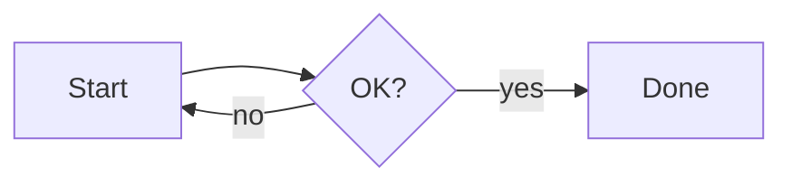

# mdv Functionality Check

This is a sample for verifying mdv rendering.

## Mermaid



## Table

| Language | Usecase |
|---|---|
| Go | Server |
| HCL | Infrastructure |

## Code blcok

```go
package main

func main() {
    println("hello")
}
```

```hcl
resource "aws_s3_bucket" "example" {
  bucket = "my-bucket"
}
```

```dockerfile
FROM golang:1.25 AS build
WORKDIR /src
COPY . .
RUN go build -o /mdv .
```

```wat
this is an unknown language and must fall back to plain text
```

## Alerts

> [!NOTE]
> This is Note.

> [!TIP]
> This is tip.

> [!IMPORTANT]
> This is important.

> [!WARNING]
> This is warning.

> [!CAUTION]
> This is caution.

## リスト

- [x] Completed task
- [ ] Incomplete task
  - Nested item
    - Nested further

Footnote test[^1]。

[^1]: This is the content of the footnote.

## Raw HTML

<script>alert(1)</script>

This is the paragraph immediately following the script.

## Images


## Deep headings

#### Deep headings

### Deep headings

### Deep headings
