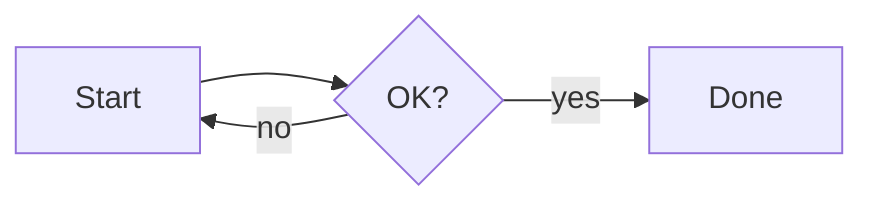

# mdv 動作確認

これは mdv のレンダリング確認用サンプルである。

## Mermaid



## テーブル

| 言語 | 用途 |
|---|---|
| Go | サーバ |
| HCL | インフラ |

## コードブロック

```go
package main

func main() {
    println("hello")
}
```

```hcl
resource "aws_s3_bucket" "example" {
  bucket = "my-bucket"
}
```

```dockerfile
FROM golang:1.25 AS build
WORKDIR /src
COPY . .
RUN go build -o /mdv .
```

```wat
this is an unknown language and must fall back to plain text
```

## Alerts

> [!NOTE]
> これは note である。

> [!TIP]
> これは tip である。

> [!IMPORTANT]
> これは important である。

> [!WARNING]
> これは warning である。

> [!CAUTION]
> これは caution である。

## リスト

- [x] 完了したタスク
- [ ] 未完了のタスク
  - ネストした項目
    - さらにネスト

脚注のテスト[^1]。

[^1]: これは脚注の内容である。

## 生 HTML

<script>alert(1)</script>

これはスクリプトの直後の段落である。

## 画像


## 深い見出し

#### 深い見出し

### 深い見出し

### 深い見出し
